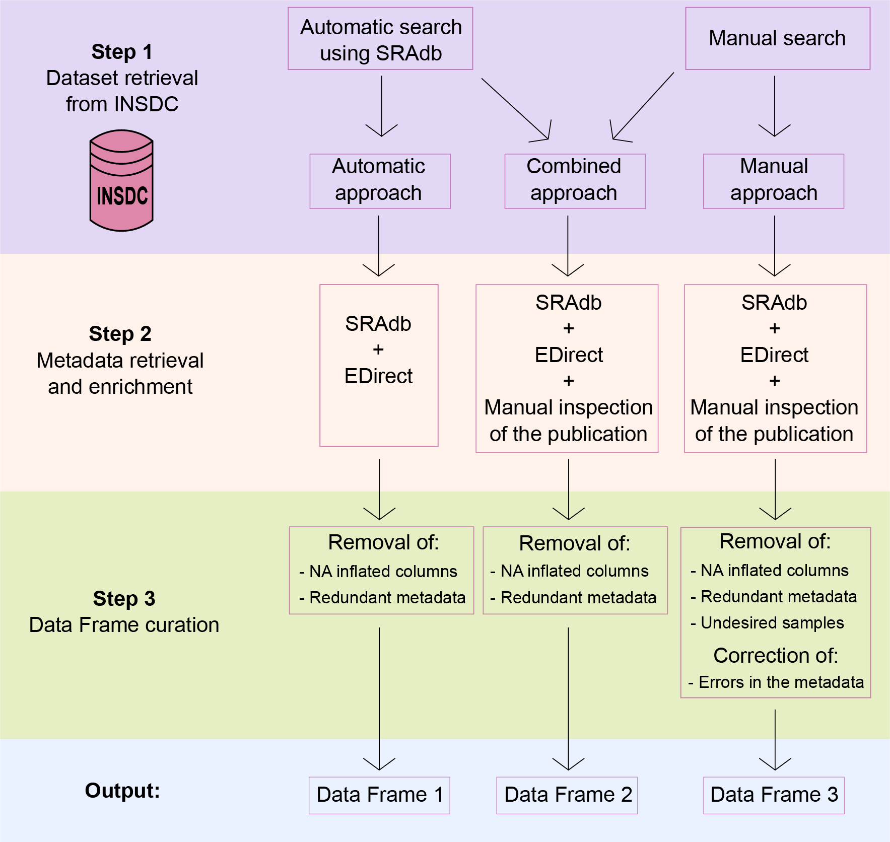

# SKIOME - Datasets and Metadata Retrieval

Here we report the bioinformatic pipeline used for the SKIOME Project: a curated collection of skin microbiome datasets enriched with study-related metadata.  
The aim of the project was to provide a comprehensive list of datasets of human skin 16S rRNA amplicon sequencing enriched with metadata.

To do so, we developed a three-step workflow organized as follows:
1) Datasets retrieval from INSDC
2) Metadata retrieval and enrichment
3) Data Frames curation

Here we describe the three steps in details:

## Step 1: Datasets retrieval from INSDC
For this step we relied on two different approaches:  
i) An automatic search with SRAdb R package (https://bioconductor.org/packages/release/bioc/html/SRAdb.html) using a full-text search with the following query: “human skin microbiome OR human skin microbiota OR human skin metagenome”.  
ii) A manual search from the SRA and ENA portals selecting only datasets coming from 16S rRNA amplicon sequencing, containing only human skin samples that were deposited from 2012 onwards and that presented an associated publication.

We then generated three Data Frames:  
- One generated by the automatic search with SRAdb (called Data Frame 1)  
- One generated by the manual search (called Data Frame 3)  
- One obtained by combaining the two searches (called Data Frame 2)

## Step 2: Metadata retrieval and enrichment
We then proceeded to collect metadata associated with the datasets in three ways:  
i) automatic search with SRAdb  
ii) automatic search with the Entrez Direct tool (EDirect) - (https://www.ncbi.nlm.nih.gov/books/NBK179288/)  
iii) manual inspection of the publication (only for the manually retrieved datasets)

## Step 3: Data Frames curation
Lastly we curated the Data Frames to:  
- Remove NA-inflated columns  
- Remove redundant metadata  
For Data Frame 3 we also:  
- Removed undesired samples  
- Corrected errors in the metadata (by double-cheking with the published study)  

## Output:
In this way we generated three different Data Frames at different curation levels:  
- Data Frame 1 (only datasets and metadata from the automatic search)
- Data Frame 2 (datasets and metadata from both the automatic and the manual searches)
- Data Frame 3 (only datasets from the manual search and metadata from both the manual and automatic searches)  
The Data Frames contains a comprehensive collection of human skin microbiome datasets enriched with metadata recovered from different sources.  
The Data Frames are easily explorable and can be useful for researchers interested in conducting meta-analyses with human skin microbiome amplicon data.  

The data frames are provided in the compressed folder "data_frames" on this github.

The result of the manual search for the datasets and metadata is provided on this github as a dataframe in .csv format called "Human_Skin_Datasets_Manual_Search".

Full codes used in this study are provided with a description in the Bioinformatic_Pipeline.md file.

Contacts
-----------------------------------------------------
* Name: __Giulia Agostinetto__
* e-mail: __g.agostinetto@campus.unimib.it__
* Name: __Davide Bozzi__
* e-mail: __d.bozzi1@campus.unimib.it__

Please refer to both contacts for further information or issues related to the framework.
